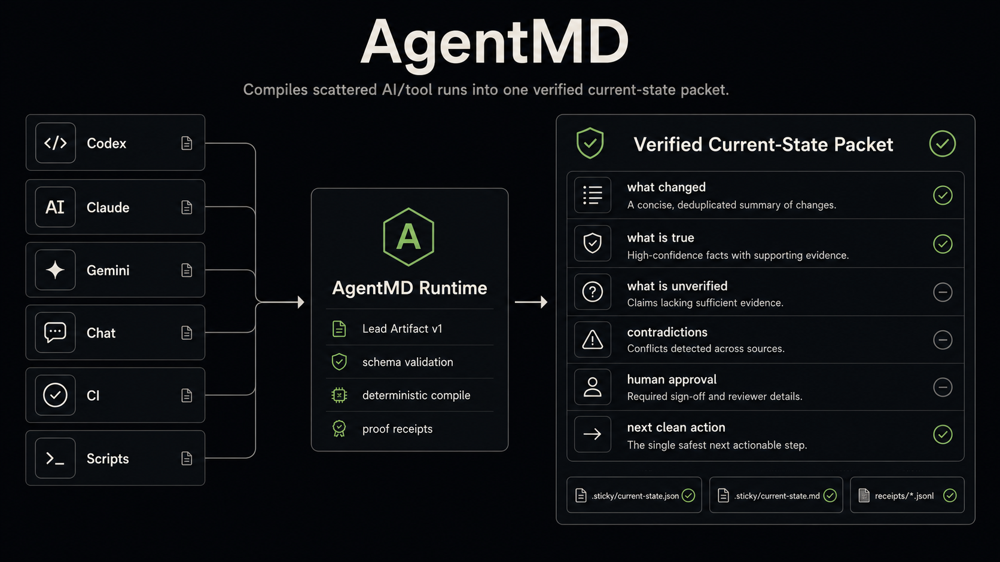
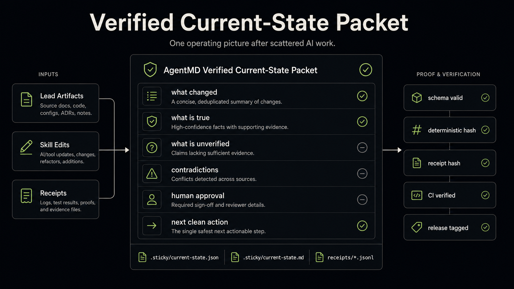

# AgentMD Runtime

[](https://github.com/electricwolfemarshmallowhypertext/agentmd-runtime/actions/workflows/ci.yml)
[](https://github.com/electricwolfemarshmallowhypertext/agentmd-runtime/actions/workflows/agentmd-lead-demo.yml)
[](https://github.com/electricwolfemarshmallowhypertext/agentmd-runtime/releases)

**AgentMD compiles scattered AI/tool runs into one verified current-state packet.**



## Proof

- Current public release: `v0.3.0-alpha.2`
- `v0.2.0`: AI Work Lead checkpoint
- `v0.3.0-alpha.2`: CI-verified alpha with gated skill edit primitive
- CI: green
- AgentMD Lead Demo: green
- AgentMD tests: `20 passed`
- Deterministic demo script: `scripts/demo-lead-compile.ps1`
- Lead Artifact schema validation is enforced (`schemas/lead-artifact.schema.json`)
- Technical proof note: `docs/proof_note.md`

## Problem

AI work is fragmented across chats, CLIs, CI logs, scripts, and partial artifacts. Teams lose truth-state when outputs are stale, contradictory, or unverifiable.

AgentMD creates one reproducible trace:

```text
task
  → validate context
  → compile current-state packet
  → enforce schema gates
  → write proof receipts
  → preserve audit trail
```

## AI Work Lead

`agentmd lead compile` turns scattered run artifacts into one verified operating picture with deterministic hashing and proof receipts.



The compiled packet includes:

- what changed
- what is true
- what is unverified
- contradictions
- human approval items
- next clean action

Runtime outputs:

- `.sticky/current-state.json`
- `.sticky/current-state.md`
- `.sticky/receipts/*.jsonl`

## Lead Artifact v1

Lead Artifact is the portable input contract for any tool (Codex, Claude, Gemini, ChatGPT, Cursor, CI jobs, scripts).

- Schema: `schemas/lead-artifact.schema.json`
- Required version field: `schema_version: "lead-artifact.v1"`
- Strict validation dependency: `jsonschema`
- Invalid artifacts fail compile with explicit schema errors

Use the portable emitter prompt and template:

- `prompts/emit-lead-artifact.md`
- `examples/lead-artifacts/template.lead-artifact.json`

## Skill Edit Gate

AgentMD includes a gated SkillOpt-style primitive for controlled skill evolution without runtime optimizer calls.

- Command: `agentmd skill apply-edit --edit <path>`
- Input schema: `schemas/skill-edit.schema.json` (`skill-edit.v1`)
- Bounded edit types only: `add`, `delete`, `replace`
- Acceptance policy: only apply when `validation_score > baseline_score`
- Accepted edits: `.sticky/skill-receipts/*.jsonl`
- Rejected edits: `.sticky/rejected-skill-edits/*.jsonl`

Scope intentionally not implemented yet:

- optimizer model that proposes edits
- multi-epoch benchmark loop
- autonomous self-editing runtime

## Core Commands

```powershell
.\agentmd.cmd doctor
.\agentmd.cmd resolve --task "review this repo for context drift"
.\agentmd.cmd receipt
.\agentmd.cmd run --adapter codex --task "review this repo for context drift"
.\agentmd.cmd lead compile --task "compile ai work lead state" --artifact examples/lead-artifacts/run-codex.jsonl --artifact examples/lead-artifacts/run-claude.json --artifact examples/lead-artifacts/run-gemini.jsonl
.\agentmd.cmd skill apply-edit --edit examples/skill-optimization/accepted-edit.json
```

## Quickstart

```bash
git clone https://github.com/electricwolfemarshmallowhypertext/agentmd-runtime.git
cd agentmd-runtime
```

```powershell
python -m pip install -r requirements-cli.txt
python -m pytest -q tests/agentmd/test_agentmd_cli.py
.\scripts\demo-lead-compile.ps1
```

## License

AgentMD Runtime is source-available under **BUSL-1.1**.

Commercial production use, hosted service use, resale, embedding into commercial products, or offering substantially similar functionality as a service requires a commercial license from the Licensor.

See `LICENSE`, `LICENSE.md`, and `NOTICE`.
